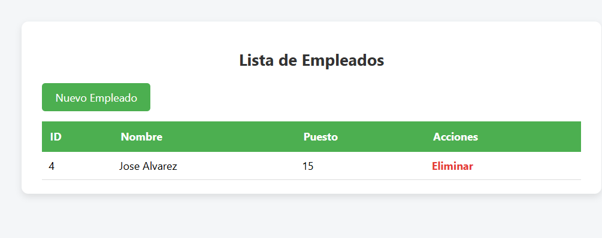
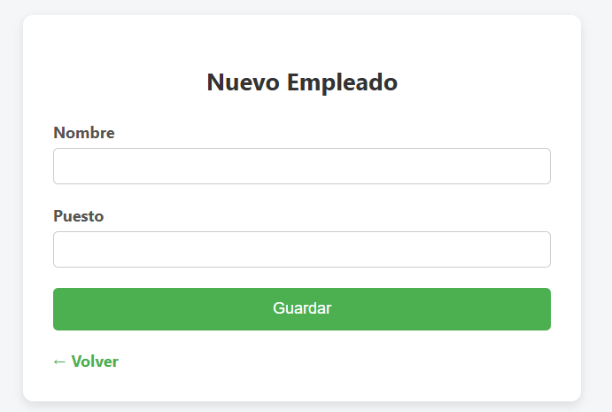

# 📋 Proyecto: Gestión de Empleados

Aplicación web simple que permite registrar, listar y eliminar empleados.  
Diseñada con una interfaz simple y limpia.

## 🚀 Tecnologías utilizadas

- ⚙️ **Spring Boot**
- 💻 **Java 24+**
- 🌐 **Thymeleaf**
- 🎨 **HTML5 / CSS3**
- 🧪 **Git**

## 📸 Capturas de pantalla

### 🧑‍💼 Lista de empleados

### ➕ Formulario de nuevo empleado

---
